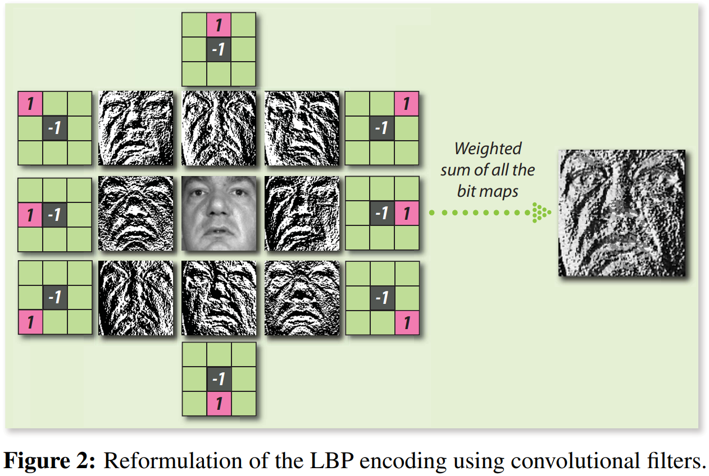
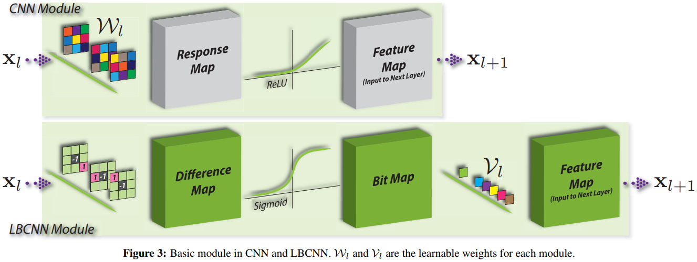

<div style="text-align: justify;">

### Work in progress
# Notas del paper "Local Binary Convolutional Neural Networks":

## Índice
- [Abstract](#abstract)
1. [Introduction](#introduction)
2. [Forming _LBP_ with Convolutional Filters](#forming-lbp-with-convolutional-filters)
3. [LBCNN](#lbcnn)
    1. [Local Binary Convolution Module](#local-binary-convolution-module)
    2. [Learning with LBC Layers](#learning-with-lbc-layers)
    3. [Theoretical Analysis](#theoretical-analysis)
4. [Experimental Results](#experimental-results)
5. [Discussion](#discussion)
6. [Conclussion](#conclussion)

- [Glosario](#glosario)

<!-- El abstract habla lo mismo que la introducción y el trabajo relacionado -->
## Abstract
Utilizan _LBP_'s como base de las capas convolucionales que proponen (_LBC_'s).

La capa _LBC_ está compuesta por filtros pre-definidos cuyos pesos no se modifican durante el entrenamiento, una función de activación no lineal y un conjunto de pesos lineales aprendibles. Los pesos lineales combinan las respuestas de activación del filtro para aproximar las repuestas de activación correpondientes de una capa convolucional estándar.

La capa _LBC_ permite un ahorro significativo de parámetros, entre _9x_ y _169x_ en el número de parámetros aprendibles comparado a una capa convoucional estándar.

Además, la naturaleza dispersa y binaria de los pesos también permite ahorrar entre _9x_ y _169x_ el tamaño del modelo en comparación con una capa convolucional estándar.

## Introduction


## Forming _LBP_ with Convolutional Filters
**Funcionamiento de los _LBP_'s:** El operador de _LBP_ tradicional opera en _patches_ de un tamaño de _3x3_, _5x5_, etc. para escanear toda la imagen de forma solapada. El descriptor _LBP_ es formado comparando secuencialmente la intensidad de los píxeles vecinos con la del píxel central (_pivote_) del _patch_, donde los píxeles con una intensidad mayor a la del píxel central se establecen a _1_ mientras que los de menor intensidad son establecidos a _0_. Finalmente, esta _cadena de bits_ es leída y mapeada a un número decimal (usando base _2_) como el valor de característica asignado al píxel central. Estos valores de características agregados  caracterizan la textura local en la imagen. El _LBP_ para el píxel central $(x_c, y_c)$ dentro del _kernel_ puede ser representado como:
<!-- <div style="text-align: center"> -->

$$\displaystyle LBP(x_c, y_c) = \sum_{n = 0}^{L - 1}{s(i_n, i_c)} * 2^n$$

**Donde:**
- $i_n$ denota la intensidad del $n^{th}$ píxel vecino.
- $i_c$ denota la intensidad del píxel central.
- $L$ es el largo de la secuencia de bits (el patrón).
- $s(i_n, i_c) = \begin{cases} 1 & \text{si } i_n \ge i_c\\ 0 & \text{de otra forma} \end{cases}

<!-- </div> -->

Por ejemplo, un _patch_ con un tamaño de $N \times N$ consiste de una _cadena de bits_ de $N^2 - 1$ bits de largo porque ese es el número de píxeles vecinos.

**Características de los _LBP_'s:**
- **Base:** La base _2_ es comúnmente usada para codificar el descriptor _LBP_, por lo tanto, las ponderaciones para codificar la _cadena de bits_ del _LBP_ están restringidas a potencias de _2_. Relajar estas restricciones y permitir a los pesos tomar cualquier valor real puede potencialmente generalizar el descriptor _LBP_.
- **Pivote:** El centro del _patch_ es típicamente elegido como el _pivote_ para comparar las intensidades de los píxeles en el _kernel_. Escoger diferentes ubicaciones en el _kernel_ como el _pivote_ puede permitir al _LBP_ codificar diferentes patrones locales de texturas. Además, la función comparativa $s(i_n, i_c)$ puede ser una función de múltiples pivotes resultando en una codificación más precisa de la textura local.
- **Orden:** _LBP_ codifica la textura local de un _kernel_ eligiendo un orden específico de píxeles para preservar parcialmente la información espacial del _kernel_. Para un _patch_ de tamaño y _pivote_ fijo, diferentes elecciones del orden de las vecindades resultan en diferente codificación de la textura local.

_Las variantes mencionadas anteriormente son elegidas empíricamente y dependen de la aplicación. Ser capaz de generalizar estos factores de variaciones en un framework aprendible es una de las motivaciones e inspiraciones detras del diseño de LBCNN._

**Reformulando los _LBP_'s con filtros convolucionales (creación de la _LBC_):** Usando _ocho_ filtros convolucionales dispersos (en una sóla convolución de toda la imagen) con un tamaño de $3 \times 3$ se obtiene el mismo resultado ([ver figura 2](#fig2)) de una forma más eficiente. Cada filtro convolucional es un filtro de dispersidad 2 para calcular la diferencia de 2 elementos. Las formulaciones estándar del _LBP_ son simplemente sumas ponderadas de todos los bits usando un vector de pesos predefinido $v\mathbf{v} = [2^7, 2^6, 2^5, 2^4, 2^3, 2^2, 2^1, 2^0]$, por lo tanto, los _LBP_ standard pueden ser reformulados como:

$$\displaystyle{y\mathbf{y} = \sum_{i = 1}^8 \sigma(\mathbf{b}_i*\mathbf{x})\cdot \mathbf{v}_i}$$

**Donde:**
- $\mathbf{x} \in \mathbb{R}^d$ es la versión vectorizada de la imagen original.
- ${\bf b}_i$ son los filtros convolucionales dispersos.
- $\sigma$ es la función Heaviside de escalón unitario.
- $\mathbf{y} \in \Bbb{R}^d$ es la imagen _LBP_ resultante.
<!-- - $y \in \Bbb{R}^d$ es la imagen con los patrones de texturas locales resultante. -->

Cambiando apropiadamente los pesos de $\mathbf{v}$; la base y el orden de condificación puede ser variado. De forma similar, cambiando apropiadamente los valores no nulos (_1_ y _-1_) en los filtros convolucionales, permite cambiar el _pivote_.

<!--  -->
<div id="fig2" style="text-align: center;">
  
</div>

------------- TESTING ----------------

$\mathbf{x} \in \mathbb{R}^d$

$$\mathbf{x} \in \mathbb{R}^d$$

$\bm{x} \in \mathbb{R}^d$

$$\bm{x} \in \mathbb{R}^d$$

$$\bm{x} \in \mathbb{R}^d$$

$\displaystyle \bm{x} \in \mathbb{R}^d$

$$\displaystyle \bm{x} \in \mathbb{R}^d$$

```math
\displaystyle \bm{x} \in \mathbb{R}^d
```

```math
\mathbf{x} \in \mathbb{R}^d
```

```math
\bm{x} \in \mathbb{R}^d
```

------------- TESTING ----------------

## LBCNN
### Local Binary Convolution Module
Como se muestra en la [figura 3](#fig3), el módulo básico de _LBCNN_ consiste de $m$ filtros convolucionales predefinidos (anchors weights) ${\bf b}_i, i \in m$. La imagen de entrada $\mathbf{x}_l$ es filtrada por estos _LBC_ filtros para generar $m$ mapas de diferencias que son pasados sobre la función de escalon unitario _Heaviside_ ($\sigma$) resultando en $m$ mapas de bits. Para permitir hacer _back propagation_ sobre la capa _LBC_, se relmplaza la función no diferenciable _Heaviside_ en el _LBP_ por una función de activación diferenciable ($sigmoid$ o $ReLU$). Finalmente, los $m$ mapas de bits son linealmente combinados por $m$ con $m$ pesos aprendibles $\cal{V}_{l, i},i \in [m]$ para generar un canal de la respuesta final de la capa _LBC_. El mapa de características de la capa _LBC_ sirve como la entrada $\mathbf{x}_{l+1}$ para la siguiente capa. Las respuestas de la capa _LBC_ para un _multi-canal_ de entrada generalizado $\mathbf{x}_l$ puede ser expresado como:

$$\displaystyle \mathbf{x}_{l + 1}^t = \sum_{i = 1}^m \sigma(\sum_s \mathbf{b}_i^{st} * \mathbf{x}_l^s)\cdot \cal{V}_{l,i}^t \text{ (1)}$$

**Donde:**
- $t$ es el canal de salida.
- $s$ es el canal de entrada

_Cabe señalar que el paso final que calcula la suma ponderada de las activaciones se puede implementar mediante una operación de convolución con filtros de tamaño 1 x 1._

Por lo tanto, cada capa _LBC_ consiste de _dos_ capas convolucionales, donde los pesos en la primer capa convolucional son fijos y _no aprendibles_ mientras que los pesos en la segunda capa convolucional lo son.

El número de parámetros aprendibles en la capa _LBC_ (con las convoluciones _1 x 1_) son significativamente más pequeños que aquellos de las capas convolucionales estándar por el mismo tamaño del filtro convolucional y número de canales de entrada y salida. Sea $p$ y $q$, el número de canales de entrada y salida respectivamente, y un filtro convolucional de tamaño $h \times w$, una capa convolucional estándar consiste de $p \cdot h \cdot w \cdot q$ parametros aprendibles, mientras que el correspondiente con una capa _LBC_ consiste de $p \cdot h \cdot w \cdot m$ pesos fijos y $m \cdot q$ parametros aprendibles (correspondiente a la convolucion _1 x 1_), donde $m$ es el número de canales intermedios de la capa _LBC_ el cual, escencialmente es el número de filtros _LBC_ fijos. Las convoluciones _1 x 1_ actúan en los $m$ mapas de activación de los filtros fijos para generar el $q$ canal de salida. El ratio del número de parámetros en una CNN y _LBC_ es:

$$frac{\text{\# param. in CNN}}{\text{\# param. in LBCNN}} = \frac{p \cdot h \cdot w \cdot q}{m \cdot q} = \frac{p \cdot h \cdot w}{m}$$

Para simplicidad, asumiendo $p = m$ reduce el ratio a $h \cdot w$.

Por lo tanto, numericamente, _LBCNN_ ahorra al menos $9\times$, $25\times$, $49\times$, $81\times$, $121\times$ y $169\times$ parametros durante el entrenamiento para los filtros convolucionales $3 \times 3$, $5 \times 5$, $7 \times 7$, $9 \times 9$, $11 \times 11$ y $13 \times 13$ respectivamente.

<div id="fig3" style="text-align: center;">
  
</div>

### Learning with LBC Layers


### Theoretical Analysis


## Experimental Results


## Discussion


## Conclussion

## Glosario:
- _LBP_ $\rightarrow$ Local Binary Pattern.
- _LBC_ $\rightarrow$ Local Binary Convolution.
- _LBCNN_ $\rightarrow$ Local Binary Convolutional Neural Network.

</div>
